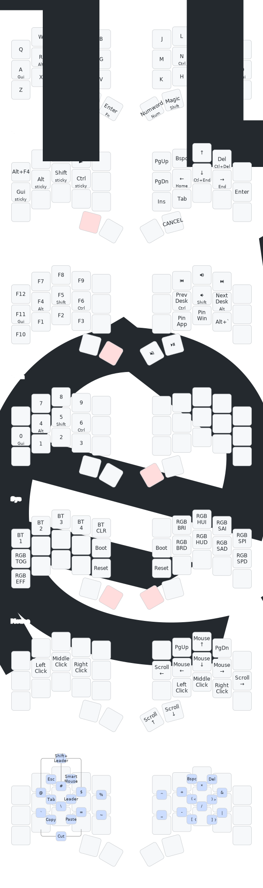

# ZMK Config for Keebart Corne Choc Pro BT

This is a fork of [urob's zmk-config](https://github.com/urob/zmk-config) adapted for the [Keebart Corne Choc Pro BT](https://www.keebart.com/products/corne-wireless).

**Huge thanks to urob** for the excellent base configuration, including timeless homerow mods, smart layers, and the comprehensive ZMK modules ecosystem. For detailed explanations of the core features, please refer to [urob's original repository](https://github.com/urob/zmk-config).

## Hardware

- **Keyboard**: [Keebart Corne Choc Pro BT](https://www.keebart.com/products/corne-wireless)
- **MCU**: nRF52840 with Bluetooth
- **Display**: nice!view e-ink displays
- **LEDs**: Per-key RGB underglow (WS2812)


## Key Features from urob's Config

This configuration inherits urob's excellent features:
- **"Timeless" homerow mods** - Virtually no misfires, no delays
- **Smart layers** - Auto-toggle numword and mouse layers
- **Combos instead of symbol layer** - Faster access to symbols
- **Magic shift** - Repeat/Sticky-shift/Capsword/Shift on one key
- **Leader key sequences** - Unicode input and system commands

For detailed explanations, see [urob's documentation](https://github.com/urob/zmk-config#highlights).



> *Keymap visualization generated with [keymap-drawer](https://github.com/caksoylar/keymap-drawer). Run `just draw` to regenerate after keymap changes.*

## My Customizations for Corne Choc Pro BT

### Board Support
- Added Corne Choc Pro BT board definition with 36-key layout (5 columns × 3 rows + 3 thumbs per hand)
- Configured nice!view display support
- Enabled per-key RGB underglow with WS2812 LEDs

### RGB Controls
Added comprehensive RGB controls on the Sys layer (FN + NUM):
- **Left side**: Toggle on/off, cycle effects
- **Right side**: Brightness, hue, saturation, and animation speed controls (organized in up/down pairs)

## Getting Started with Corne Choc Pro BT

### Prerequisites
1. Fork this repository
2. Enable GitHub Actions in your fork
3. Install [Nix](https://nixos.org/download.html) for local development (optional)

### Building Firmware

**Using GitHub Actions (Recommended):**
1. Make changes to `config/base.keymap` or other config files
2. Commit and push to your repository
3. GitHub Actions will automatically build the firmware
4. Download the `firmware` artifact from the Actions tab
5. Extract and flash the `.uf2` files to your keyboard

**Local Build:**
```bash
# Clone your fork
git clone https://github.com/YOUR_USERNAME/zmk-config-urob
cd zmk-config-urob

# Set up Nix environment (first time)
direnv allow
just init

# Build firmware
just build corne_choc_pro
```

### Flashing the Keyboard
1. Put the keyboard into bootloader mode (double-tap reset button)
2. A USB drive named "KEEBART" will appear (note: this name may vary - could be "NICENANO" or another name depending on your bootloader)
3. Copy the corresponding `.uf2` file from the `firmware/` folder to the drive:
   ```bash
   # From GitHub Actions (download and extract firmware.zip first)
   cp firmware/corne_choc_pro_left-nice_view.uf2 /Volumes/KEEBART/
   cp firmware/corne_choc_pro_right-nice_view.uf2 /Volumes/KEEBART/

   # From local build
   cp firmware/nice_view-corne_choc_pro_left.uf2 /Volumes/KEEBART/
   cp firmware/nice_view-corne_choc_pro_right.uf2 /Volumes/KEEBART/
   ```
4. The keyboard will automatically reboot with the new firmware

### Steps I Took to Add Corne Choc Pro BT Support

1. **Created board definition** in `config/boards/arm/corne_choc_pro/`:
   - `corne_choc_pro.dtsi` - Base device tree with matrix transform and hardware config
   - `corne_choc_pro_left.dts` / `corne_choc_pro_right.dts` - Split keyboard halves with RGB LED strips
   - `corne_choc_pro_left_defconfig` / `corne_choc_pro_right_defconfig` - Board-specific Kconfig
   - `corne_choc_pro.zmk.yml` - Board metadata with siblings configuration

2. **Fixed board references** in `corne_choc_pro.zmk.yml` to use correct sibling names

3. **Added RGB support** in defconfig files and keymap with full controls

4. **Updated `build.yaml`** to build for corne_choc_pro with nice!view shields

---

## Detailed Documentation

For comprehensive documentation on the following topics, please refer to [urob's original repository](https://github.com/urob/zmk-config):

- [Timeless homerow mods](https://github.com/urob/zmk-config#timeless-homerow-mods) - Configuration and troubleshooting
- [Combos](https://github.com/urob/zmk-config#using-combos-instead-of-a-symbol-layer) - Symbol layer replacement
- [Smart layers](https://github.com/urob/zmk-config#smart-layers-and-other-gimmicks) - Numword, smart-mouse, magic shift, swapper, leader key
- [Local build environment](https://github.com/urob/zmk-config#local-build-environment) - Detailed Nix setup instructions
- [Issues and workarounds](https://github.com/urob/zmk-config#issues-and-workarounds) - Known limitations

## Related Resources

- [urob's ZMK modules collection](https://github.com/search?q=topic%3Azmk-module+fork%3Atrue+owner%3Aurob+&type=repositories) - Used in this configuration
- [ZMK Firmware Documentation](https://zmk.dev/) - Official ZMK docs
- [Keebart Corne Choc Pro BT](https://www.keebart.com/products/corne-wireless) - Hardware specifications

## License

This configuration is based on [urob's zmk-config](https://github.com/urob/zmk-config) and inherits its MIT license.
